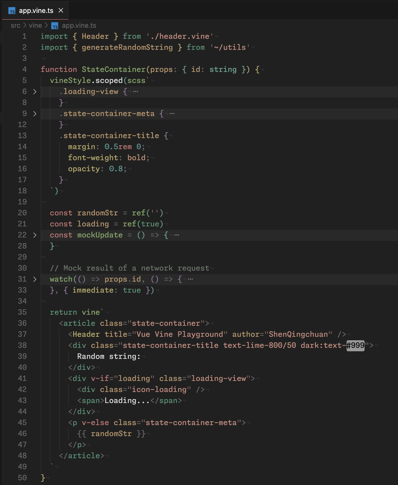

# Vue Vine 

[English README](./README.md)

创造另一种书写 Vue 组件的方式。

要了解更多细节，请查看我们的[文档](https://vue-vine.dev/)。 [](https://app.netlify.com/sites/vue-vine/deploys)

<details>
  <summary>
    <b>为什么做这样一个项目？</b>
  </summary>
  <br>

  在社区中，有很多帖子讨论过希望有一个支持在单个文件中编写多个 Vue 组件的解决方案。`Vue Vine` 因此而生。

  `Vue Vine` 旨在提供更多管理 Vue 组件的灵活性，它并不是要取代 Vue SFC，而是作为一种并行的解决方案。

  下面是一个简单的示例预览：

  

</details>

## 安装

```bash
# 如果你还没有安装 `@antfu/ni`，我强烈建议你安装它。
ni -D vue-vine
```

在 `vite.config.ts` 中使用插件：

```ts
import { VineVitePlugin } from 'vue-vine/vite'

export default defineConfig({
  plugins: [
    // ...其他插件
    VineVitePlugin()
  ],
})
```

然后在 `tsconfig.json` 中添加宏的类型定义：

```json
{
  "compilerOptions": {
    "types": ["vue-vine/macro"]
  }
}
```

最后，安装 VSCode 插件，在市场中搜索 `Vue Vine`。


## 尝试示例

你可以按照下面的步骤操作，启动示例项目来预览：

首先，你需要获取 VSCode 插件的构建输出。

```bash
git clone https://github.com/vue-vine/vue-vine.git
cd vue-vine
pnpm install

# 构建所有相关的包
pnpm run build

# 开启 VSCode 插件的构建监听
pnpm run dev:ext
```

在构建完 VSCode 插件后，你可以在 VSCode 的 'Debug' 选项卡中找到 'Rune Vine Extension' 的配置项，然后点击运行。


然后，在另一个终端会话中开启 Playground 的 Vite 开发服务器。

```bash
pnpm run play
```

1. 接下来可以在 `http://localhost:3333/` 中看到示例。
2. 你可以在 `http://localhost:3333/__inspect/` 中查看源代码在 Vite 处理管道的转换过程。
