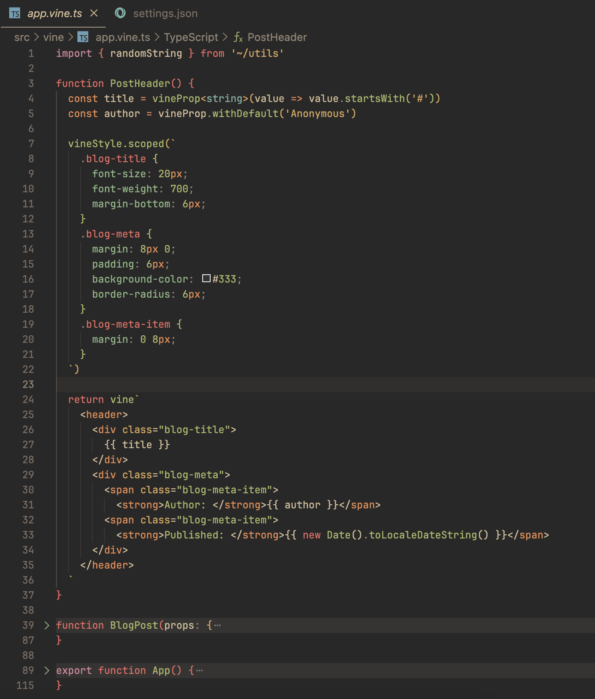

# Vue Vine

[English README](./README.md)

创造另一种书写 Vue 组件的方式。

## 背景

在社区中，有很多帖子讨论过希望有一个支持在单个文件中编写多个 Vue 组件的解决方案。`Vue Vine` 因此而生。

`Vue Vine` 旨在提供更多管理 Vue 组件的灵活性，它并不是要取代 Vue SFC，而是作为一种并行的解决方案。

下面是一个简单的示例预览：



## 开始使用

**注意:** 目前，Vue Vine仍处于密集开发阶段，请不要将其用于生产环境。

你可以按照下面的步骤操作，启动示例项目来预览

```bash
git clone https://github.com/vue-vine/vue-vine.git
cd vue-vine
pnpm install

# 开启插件的构建监听
pnpm run dev

# 开启 Playground 的 Vite 开发服务器
pnpm run play
```

1. 接下来可以在 `http://localhost:3333/` 中看到示例。
2. 你可以在 URL 查询参数上添加 `?sfc` 来切换回 SFC 示例。
3. 你可以在 `http://localhost:3333/__inspect/` 中查看源代码在 Vite 处理管道的转换过程。