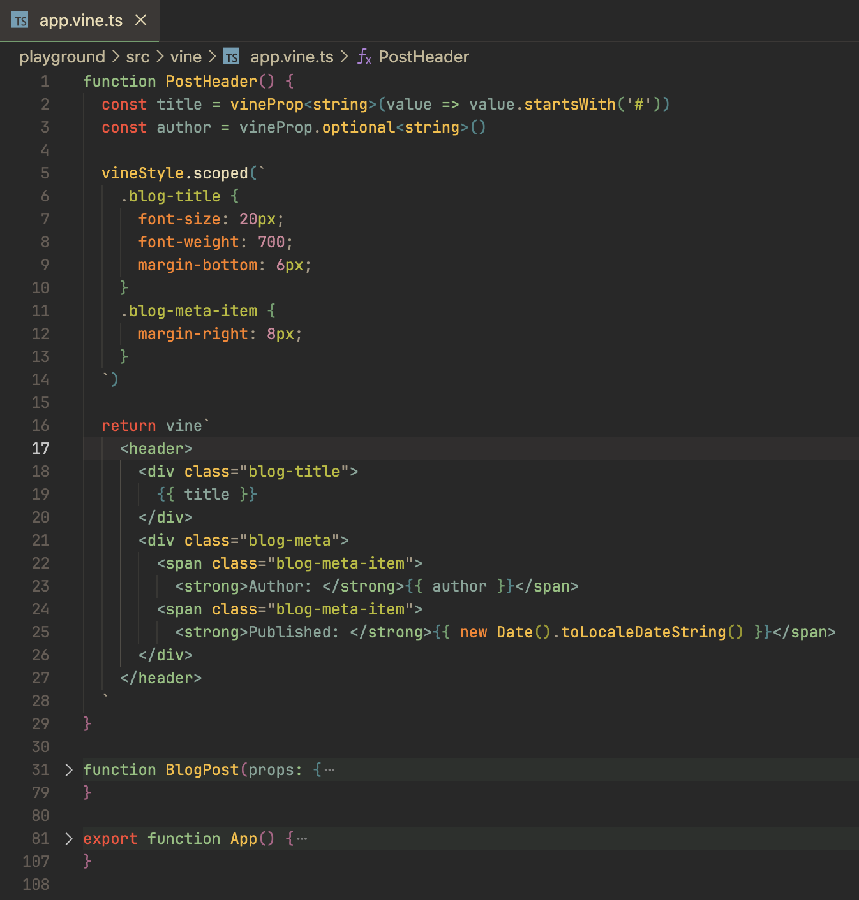

# Vue Vine

[中文 README](./README-CN.md)

Another style of writing Vue components.

## Why this ?

There are many discussions in community that hopes for a solution that supports writing multiple Vue components in a single file. That's why Vue Vine was born.

Vue vine was designed to provide more flexibility of managing Vue components. It's not a replacement of Vue SFC, but a parallel solution.

Take a quick view:



## Get started

**warning:** For now, Vue Vine is still under heavily development. Please don't use it in production.

You can try the demo by following steps:

```bash
git clone https://github.com/vue-vine/vue-vine.git
cd vue-vine
pnpm install

# Start watching the plugin's building
pnpm run dev

# Start Playground's Vite dev server
pnpm run play
```

1. You can see the demo in `http://localhost:3333/`.
2. You can add URL query `?sfc` to switch back to SFC style example.
3. You can inspect the transforming process in `http://localhost:3333/__inspect/`
