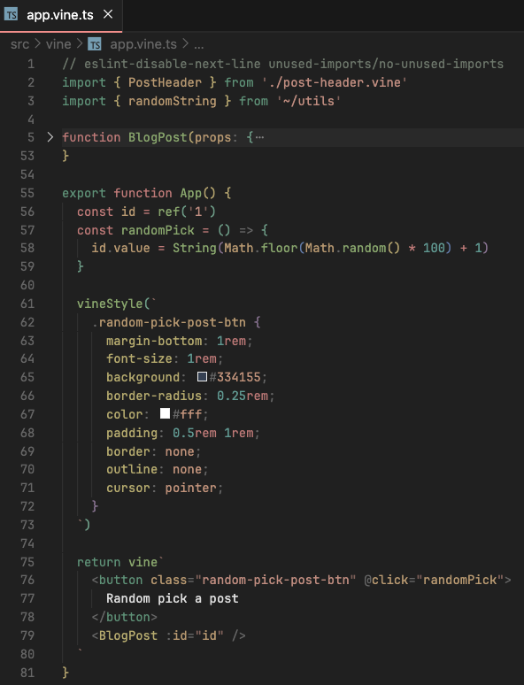

# Vue Vine extension

## Syntax highlight

This extension provide basic syntax highlight for Vue Vine.

Here's an example, as you can see, the stylesheet written in SCSS and Vue template HTML are all highlighted:

